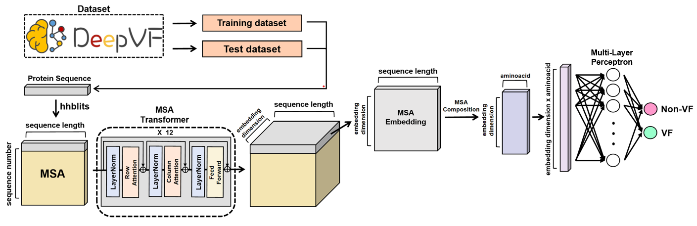

# MSA-VF Predictor: Coevolutionary Signals in Protein Sequences for Virulence Factor Prediction using MSA Transformer
The official code implementation for the paper [MSA-VF Predictor: Coevolutionary Signals in Protein Sequences for Virulence Factor Prediction using MSA Transformer]

## Model Architecture
The overall framework of our work is shown below.


## Dataset
All the data used in the experiments can be found in the data folder.

## MSA-composition
### MSA generation
Step 1. Download uniclust30_2017_10_hhsuite.tar.gz
```
curl -O https://wwwuser.gwdg.de/~compbiol/uniclust/2017_10/uniclust30_2017_10_hhsuite.tar.gz
```
Step 2. Use hhblits to generate Multiple Sequence Alignment (MSA)
```
hhblits -i [INPUT] -o [OUTPUT] -oa3m [RESULT_MSA] -d [DB_BASENAME]
```

### MSA-composition generation
To generate MSA-composition from MSA data, run "generate_msa_composition.py"
```
python generate_msa_composition.py --msa [INPUT (.a3m)] --msa_composition [OUTPUT (.npy)]
```

## Seqsim
Step 1. Make blast database (blast target database for train_positive and train_negative are in "code/blast_db")
```
makeblastdb -in [INPUT] -title [DB_TITLE] -dbtype prot -out [DB_NAME]
```
Step 2. BLASTP query sequence search for DB
```
blastp -query [INPUT] -db [BLAST_DB] -evalue 10 -out [OUTPUT] -matrix [BLOSUM62]
```
Step 3. Highest bitscores against the positive and negative training dataset (blast database) is seqsim feature

#### You can easily obtain the seqsim feature by running the "generate_seqsim.sh" script located in the "code" folder.
```
bash generate_seqsim.sh [INPUT (example1.fasta)]
```
---> As a result, you will obtain "study1_seqsim.npy".
